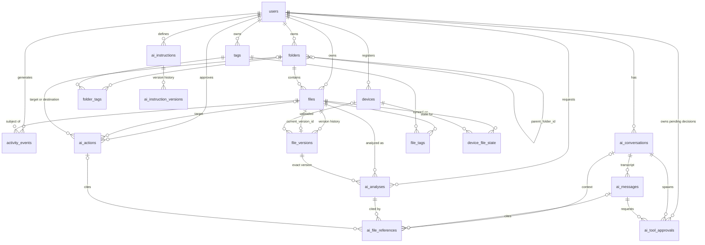

# Smart File Manager — Database Schema Design

> **Status:** Formal Phase 6 design — **documentation only.** No database, tables, migrations, ORM, credentials, or connection code exist yet. This document is the authoritative reference for all future database work and lives in `backend/src/database/` beside the layer-boundary README.
>
> **Target engine:** PostgreSQL. The model is provider-neutral, but PostgreSQL-specific features used below (partial indexes, `citext`, `num_nonnulls`) are explicitly marked.
>
> **Conventions:** Primary keys are UUIDs (v7 preferred: time-ordered, index-friendly, non-enumerable) — except append-only event tables, which use monotonic `bigint` identity. All timestamps are `timestamptz`. Every table marks each field as required, nullable, or PK.

**Contents:** 1 Purpose · 2 Architecture and storage boundaries · 3 Design principles · 4 Entity relationship overview · 5 Core tables · 6 AI tables · 7 Relationships and constraints · 8 Indexing strategy · 9 Delete/trash semantics · 10 File versioning strategy · 11 Sync-state strategy · 12 AI data strategy · 13 Security/ownership considerations · 14 Deferred areas · 15 Future migration considerations · Appendices A–B

---

## 1. Purpose

This document defines the complete relational data model for the Smart File Manager cloud platform: accounts and devices, the cloud folder/file tree, immutable file versioning, per-device synchronization state, organization (stars, tags), filesystem activity history, and the AI layer (conversations, instructions, analyses, and approval-gated actions).

It exists to:

- serve as the single source of truth that future migrations are written against (Phase 6+);
- fix the boundary between **metadata** (PostgreSQL) and **content** (object storage) before any implementation is chosen;
- make the desktop sync engine, the web application, and the AI layer agree on one shared model of "a file".

It is **not** an implementation document: it defines no ORM models, no SQL migrations, no API shapes, and selects no infrastructure.

### 1.1 What this schema models — and what it never touches

The database describes the **cloud** world only:

- A **local file** (`/Users/me/Docs/report.pdf`) exists only on the device's OS filesystem and is visible only to the desktop app via Tauri/Rust. The backend has no column, key, or path for it — except the strictly informational `device_file_state.local_path` (§11), which the server never acts on.
- The **backend must never be given arbitrary access to a personal computer's filesystem**. Nothing in this schema provides one.
- The **web application** only ever sees rows in this database plus objects in storage — never the user's machine.

## 2. Architecture and storage boundaries

### 2.1 Where each kind of data lives

```
Desktop app ──▶ Tauri/Rust ─────────────▶ Local OS filesystem   (desktop only — never the backend's business)
Desktop app ──▶ Sync engine (Phase 9) ─▶ Backend API ──┐
Web app ─────▶ Backend API ────────────────────────────┤
                                                       ▼
                              PostgreSQL (metadata)  +  Object storage (bytes)
```

| # | Concept | Lives in | Represented in this schema by |
|---|---------|----------|-------------------------------|
| 1 | **Local file** on a user's computer | Real local OS filesystem (desktop only) | Not represented — only informational `device_file_state.local_path` |
| 2 | **File selected for synchronization** | A relationship between a device and a cloud file | A `device_file_state` row (device ↔ file) |
| 3 | **Cloud copy** of a synced file | Object/file storage — one immutable object per version | Bytes only; the DB stores `file_versions.storage_key` |
| 4 | **Database record** describing files | PostgreSQL | `folders`, `files`, `file_versions`, and every other table here |

### 2.2 The hard storage rule

- **PostgreSQL stores structured metadata and relationships only:** accounts, tree structure, names, sizes, hashes, MIME types, versions, sync state, stars, tags, activity, AI history and results.
- **Actual file contents are never stored in PostgreSQL rows.** Synced file bytes live in object/file storage as **one immutable object per `file_version`**.
- **`storage_key` is only a reference** — a server-generated pointer (e.g. `u/{user_id}/{version_id}`) into object storage. It is not a path on any user's machine and not a database blob.
- Large AI-derived artifacts (extracted document text, future embeddings) follow the same rule: object storage + a DB reference (`ai_analyses.extracted_text_key`), never inline rows (§12).

## 3. Design principles

- **D1 — Separate `folders` and `files` tables.** Honest FK integrity (tag rows can only reference files), no type-discriminator checks, simple listings. A single polymorphic `nodes` table was rejected.
- **D2 — Parent-link tree; no canonical full paths.** `parent_folder_id` defines structure; breadcrumbs and subtrees are computed (recursive CTEs). Stored path strings would drift on every rename/move.
- **D3 — Denormalized `user_id` on every user-visible row.** Ownership is checkable on every row (`WHERE user_id = :me`) without joins, and row-level security becomes possible later.
- **D4 — Immutable versions + `current_version_id`.** `files` is a thin mutable shell (name, parent, star, trash); all content facts (size, hash, storage key) live on `file_versions`. Revisions, conflicts, and restore all fall out of one mechanism.
- **D5 — Soft delete (`deleted_at`) = Trash.** Partial unique constraints so a deleted name frees its sibling slot; hard delete is an explicit background/retention path, not a UI path.
- **D6 — Stars are boolean columns** on files and folders (single-owner product today); a per-user star table is a cheap later migration if sharing arrives.
- **D7 — `device_file_state` is the sync bridge.** "Selected for sync" = a row here; per-device status, errors, and conflict bookkeeping stay off the shared file record.
- **D8 — Duplicates are derived, not stored.** `GROUP BY sha256` over current versions yields duplicate groups; no cache tables until profiling demands them (Phase 12).
- **D9 — The server is authoritative.** Name/MIME/hash validation, `storage_key` generation, and event timestamps are server-side; client clocks and client paths are never trusted.
- **D10 — Monotonic `bigint` for append-only event tables.** `activity_events.id` (and the future `sync_events.id`) double as pull cursors for incremental sync.
- **A1 — The AI layer is first-class but inert.** AI tables record conversations, knowledge, proposals, and outcomes. **Only application services mutate filesystem/sync state** — AI never writes `files`/`folders`/`device_file_state` directly; it proposes `ai_actions`, and a service executes them exactly like a user action (§12).
- **A2 — AI outputs are pinned to exact versions.** An analysis references `file_id` + `version_id`, so "what the AI saw" stays answerable forever.
- **A3 — Large AI artifacts go to object storage.** The DB keeps small structured results (`jsonb`) and references, never bulk content.

## 4. Entity relationship overview



**Cardinality summary:** one user → many devices / folders / files / tags / conversations / analyses / instructions / actions; one folder → many subfolders and files (self-referencing `parent_folder_id`, `NULL` = root); one file → many versions with exactly one current; files ↔ tags and folders ↔ tags many-to-many (separate link tables); devices ↔ files many-to-many via per-device sync state; one conversation → many messages; one instruction → many instruction versions; analyses, references, and actions all pin files, versions, folders, conversations, and messages by FK; generic tool-approval requests are owned by a conversation and the message that produced them. The full FK/cascade matrix is in §7.

## 5. Core tables

### 5.1 `users` — accounts

One row per account. The table ships in the first migration; authentication-related fields are populated in Phase 7 (§14).

| Field | Type | Req | Notes |
|---|---|---|---|
| `id` | uuid | PK | |
| `email` | text | required | Login identity. **UNIQUE**, case-normalized (`citext` on PG, or a `lower()` expression index) |
| `display_name` | text | required | User-visible name |
| `password_hash` | text | required (from Phase 7) | Argon2/bcrypt hash — **never returned by any API** |
| `status` | text | required | CHECK: `active` or `disabled`; default `active` |
| `created_at` | timestamptz | required | Server time |
| `updated_at` | timestamptz | required | |

**Constraints & rules**

- **PK:** `id`. **FKs:** none — this is the ownership root.
- **Unique:** `email`.
- Every user-visible table in this schema carries `user_id` pointing here (D3). Future session/share tables also point here.

### 5.2 `devices` — registered desktop clients

One row per desktop installation authorized against an account.

| Field | Type | Req | Notes |
|---|---|---|---|
| `id` | uuid | PK | |
| `user_id` | uuid | required | FK → `users` **ON DELETE CASCADE** |
| `device_uid` | text | required | Client-generated stable UUID persisted in desktop config (not the OS hostname). **UNIQUE (user_id, device_uid)** |
| `name` | text | required | User-visible label ("MacBook Pro") |
| `platform` | text | nullable | `macos`, `windows`, or `linux` (informational) |
| `app_version` | text | nullable | Informational |
| `created_at` | timestamptz | required | |
| `last_seen_at` | timestamptz | required | Updated opportunistically on API activity |

**Constraints & rules**

- **PK:** `id`. **FK:** `user_id` CASCADE. **Index:** `(user_id)`.
- Deleting a device removes its sync state (`device_file_state` cascades) but **never** the files it uploaded — `file_versions.device_id` is SET NULL.
- Devices are the only entities allowed to speak for the local filesystem; even they only ever report *about* it, never expose it.

### 5.3 `folders` — cloud folder tree

The user's cloud directory tree: self-referencing parent links, no stored paths (D2).

| Field | Type | Req | Notes |
|---|---|---|---|
| `id` | uuid | PK | |
| `user_id` | uuid | required | FK → `users` **ON DELETE CASCADE** (denormalized owner, D3) |
| `parent_folder_id` | uuid | **nullable** | FK → `folders` **ON DELETE CASCADE**; `NULL` = the user's root |
| `name` | text | required | Display name, case preserved. CHECK: `char_length` 1–255 |
| `is_starred` | boolean | required | Default `false` (D6) |
| `deleted_at` | timestamptz | nullable | Soft delete → Trash (D5) |
| `created_at` / `updated_at` | timestamptz | required | |

**Constraints & rules**

- **PK:** `id`. **FKs:** `user_id` CASCADE; `parent_folder_id` → `folders.id` CASCADE.
- **UNIQUE (parent_folder_id, lower(name)) — partial, `WHERE deleted_at IS NULL`** *(PG)*: no two live siblings share a name case-insensitively; a trashed name frees its slot.
- **Partial UNIQUE (user_id) `WHERE parent_folder_id IS NULL`**: exactly one live root folder per user — replaces a `users.root_folder_id` back-pointer and avoids a circular FK.
- **Indexes:** `(user_id, parent_folder_id)` — directory listings; partial `(user_id)` `WHERE is_starred` — Starred view; partial `(user_id)` `WHERE deleted_at IS NOT NULL` — Trash view.
- **Folder moves must never create a cycle** (a folder placed inside its own descendant). PostgreSQL cannot express this constraint; the application service must validate via an ancestor walk of the destination before every move (§7).
- **Trash is non-recursive (§9):** soft-deleting a folder hides its subtree implicitly; global views must exclude items with a trashed ancestor; restore re-validates names app-side.
- Breadcrumbs and subtree operations are recursive CTEs over `parent_folder_id`.

### 5.4 `files` — logical file identity

The canonical cloud file: **identity and location**, not content. All content facts live on versions (D4).

| Field | Type | Req | Notes |
|---|---|---|---|
| `id` | uuid | PK | This is the `cloudId` the desktop/web layers reference |
| `user_id` | uuid | required | FK → `users` **ON DELETE CASCADE** (D3) |
| `parent_folder_id` | uuid | required | FK → `folders` **ON DELETE CASCADE** (hard delete of a folder removes contained files) |
| `name` | text | required | CHECK: `char_length` 1–255 |
| `mime_type` | text | nullable | Determined **server-side** at upload; never trusted from the client |
| `current_version_id` | uuid | nullable | FK → `file_versions` **ON DELETE SET NULL** (defensive — see rules). `NULL` = record created, bytes not yet uploaded |
| `is_starred` | boolean | required | Default `false` |
| `deleted_at` | timestamptz | nullable | Soft delete → Trash |
| `created_at` / `updated_at` | timestamptz | required | Record times; *content* times live on versions / device state |

**Constraints & rules**

- **PK:** `id`. **FKs:** `user_id` CASCADE; `parent_folder_id` CASCADE; `current_version_id` SET NULL.
- **UNIQUE (parent_folder_id, lower(name)) — partial, `WHERE deleted_at IS NULL`** *(PG)* — same sibling rule as folders.
- **Indexes:** `(user_id, parent_folder_id)`; partial `(user_id)` `WHERE is_starred`; `(user_id, deleted_at)`; `(current_version_id)`.
- **No `size_bytes` here** — the current version's size is authoritative; a second source of truth would drift (D4). Listings join `file_versions` by PK.
- `current_version_id` forms a **circular FK** with `file_versions.file_id`; it is created in two migration steps (§7).
- **Never delete a version while it is current.** Future content retirement must move the pointer first, then delete the old version; the SET NULL is a safety net, not a workflow.

### 5.5 `file_versions` — immutable content revisions

One row per uploaded revision; rows are **write-once** (D4).

| Field | Type | Req | Notes |
|---|---|---|---|
| `id` | uuid | PK | Also the object-storage identity |
| `file_id` | uuid | required | FK → `files` **ON DELETE CASCADE** |
| `version_number` | integer | required | Monotonic per file from 1. **UNIQUE (file_id, version_number)** |
| `storage_key` | text | required | **Server-generated object-storage reference** (e.g. `u/{user_id}/{version_id}`) — a pointer, never a path on a user's machine (§2.2). UNIQUE for now; may be relaxed for content-addressed dedupe (§15) |
| `size_bytes` | bigint | required | CHECK: `>= 0` |
| `sha256` | char(64) | required | Lowercase hex content hash. **Indexed** |
| `device_id` | uuid | nullable | FK → `devices` **ON DELETE SET NULL** — provenance survives device removal |
| `created_at` | timestamptz | required | When this version became current (server time, D9) |

**Constraints & rules**

- **PK:** `id`. **FK:** `file_id` CASCADE (deleting the file deletes its history; actual byte cleanup in storage is a Phase 8 concern).
- **Index:** `(sha256)` — duplicate detection and sync comparison.
- **`sha256` roles:** (1) content identity independent of name/path; (2) duplicate detection via `GROUP BY` (D8); (3) sync optimization — upload/download can be skipped when hashes match.
- **Immutability:** rows are never UPDATEd. A bad upload is a new version or a failed upload, not a correction.
- The device-reported content mtime is intentionally **not** stored here; it lives in `device_file_state.local_mtime` (device-specific, untrusted).

### 5.6 `tags` — user-defined labels

| Field | Type | Req | Notes |
|---|---|---|---|
| `id` | uuid | PK | |
| `user_id` | uuid | required | FK → `users` **ON DELETE CASCADE** |
| `name` | text | required | Tag label |
| `color` | text | nullable | UI hint; validated app-side |
| `created_at` | timestamptz | required | |

**Constraints & rules**

- **UNIQUE (user_id, lower(name))** — tag names unique per user, case-insensitively; this index also serves every `(user_id)`-prefix lookup, so no standalone `user_id` index is needed (audit: the previously listed standalone index was redundant).

### 5.7 `file_tags` — file ↔ tag links

| Field | Type | Req | Notes |
|---|---|---|---|
| `file_id` | uuid | PK part | FK → `files` **ON DELETE CASCADE** |
| `tag_id` | uuid | PK part | FK → `tags` **ON DELETE CASCADE** |
| `created_at` | timestamptz | required | |

**Constraints & rules**

- **PK (file_id, tag_id)** — one link per pair. **Index:** `(tag_id)` for reverse lookup ("all files with tag X").
- Tags attach to files via this table and to folders via the separate `folder_tags` table below — never to both through one polymorphic column (D1): each link table's own FKs make cross-target attachment structurally impossible.
- **Cross-user pairing rule (app-enforced):** a link row must pair a file/folder and a tag belonging to the same `user_id`; services validate ownership of both sides on every link/unlink (§13).

#### `folder_tags` — folder ↔ tag links (twin of `file_tags`)

Folders are taggable on the same terms as files (they already carry `is_starred`), so organization parity is part of the model rather than a postponed decision (audit resolution).

| Field | Type | Req | Notes |
|---|---|---|---|
| `folder_id` | uuid | PK part | FK → `folders` **ON DELETE CASCADE** |
| `tag_id` | uuid | PK part | FK → `tags` **ON DELETE CASCADE** |
| `created_at` | timestamptz | required | |

**Constraints & rules**

- **PK (folder_id, tag_id)** — one link per pair; **Index:** `(tag_id)` for reverse lookup ("all folders with tag X").
- Same cross-user pairing rule as `file_tags` (app-enforced, §13).
- AI scope: `ai_actions.apply_tags`/`remove_tags` remain file-targeted in this design; AI application of folder tags would extend `action_type` later using the same approval flow (§6.7).

### 5.8 `device_file_state` — the local ↔ cloud sync bridge

One row per (device, file) that a device knows about. **A row existing means "this file is selected for sync on this device"** (concept 2, §2.1). This is the only place per-device sync reality is stored (D7).

| Field | Type | Req | Notes |
|---|---|---|---|
| `device_id` | uuid | PK part | FK → `devices` **ON DELETE CASCADE** |
| `file_id` | uuid | PK part | FK → `files` **ON DELETE CASCADE** |
| `local_path` | text | nullable | **Informational only** — the server never reads or acts on it (§1.1) |
| `local_mtime` | timestamptz | nullable | Device-reported content mtime; enables conflict checks without trusting clocks for ordering (D9) |
| `local_version_id` | uuid | nullable | FK → `file_versions` **ON DELETE SET NULL** — last version this device confirmed it holds |
| `sync_status` | text | required | CHECK: `synced`, `pending_upload`, `uploading`, `pending_download`, `downloading`, `conflict`, `error` |
| `conflicting_version_id` | uuid | nullable | FK → `file_versions` **ON DELETE SET NULL** — where the conflict "loser" is preserved (it is already a full version, so nothing is lost) |
| `last_error` | text | nullable | Retry display |
| `last_synced_at` | timestamptz | nullable | |
| `updated_at` | timestamptz | nullable | |

**Constraints & rules**

- **PK (device_id, file_id)**; both FKs CASCADE — device removal or file deletion wipes state cleanly.
- **Indexes:** partial `(device_id)` `WHERE sync_status <> 'synced'` — the device's work/retry queue; `(file_id)` — "which devices hold this file".
- Per-device independence: one device's error state never blocks another device.
- Status lifecycle and conflict flow: §11.

### 5.9 `activity_events` — filesystem activity history (Recent view, audit)

Append-only log of **what actually changed**. AI-driven operations are written here too — by services (§12) — so the audit trail is uniform; only `detail` provenance distinguishes origins.

| Field | Type | Req | Notes |
|---|---|---|---|
| `id` | bigint identity | PK | Monotonic; a natural cursor |
| `user_id` | uuid | required | FK → `users` **ON DELETE CASCADE** |
| `device_id` | uuid | nullable | FK → `devices` **ON DELETE SET NULL** (`NULL` = web- or AI-originated) |
| `file_id` | uuid | nullable | FK → `files` **ON DELETE CASCADE** |
| `folder_id` | uuid | nullable | FK → `folders` **ON DELETE CASCADE**; at least one of `file_id`/`folder_id` is required for filesystem actions (app-enforced, §7) |
| `action` | text | required | CHECK: `upload`, `download`, `create`, `rename`, `move`, `delete`, `restore`, `star`, `unstar`, `tag`, `untag` |
| `detail` | jsonb | nullable | e.g. rename from/to, AI provenance (§12) |
| `occurred_at` | timestamptz | required | Default `now()` (server time) |

**Constraints & rules**

- **Append-only**: no UPDATE/DELETE in normal operation; retention pruning is deferred (§14).
- **Indexes:** `(user_id, occurred_at DESC)` — Recent feed; `(file_id)` — per-file history.
- Provenance example: `{"source":"ai","aiActionId":"…","aiConversationId":"…"}` (§12).

## 6. AI tables

The AI layer is a first-class product surface, so its data model is explicit rather than an afterthought. Two principles govern it (A1–A3, §3): **AI is inert without application services**, and **AI output is pinned to exact file versions**.

> **Where structured AI analysis lives:** the `ai_file_insights` table sketched in the earlier Phase 6 discussion is **superseded and dropped**. `ai_analyses` (per-version structured analysis), `ai_actions` (proposals + outcomes), and `ai_file_references` (exact-version citations) cover summaries, tag suggestions, and organization proposals without a fourth overlapping table. Any future "insight" is a new `analysis_kind` on `ai_analyses`, not a new table.

### 6.1 `ai_conversations` — persistent AI conversations

| Field | Type | Req | Notes |
|---|---|---|---|
| `id` | uuid | PK | |
| `user_id` | uuid | required | FK → `users` **ON DELETE CASCADE** |
| `title` | text | nullable | Auto-derived from the first message; user-renamable |
| `created_at` / `updated_at` | timestamptz | required | `updated_at` bumps on new messages |
| `max_tool_rounds` | int | required | DEFAULT `1`. Loop bound for the bounded agent tool loop (Phase 10.6 `maxToolRounds`), persisted so turn progress is reconstructible across sessions. |
| `archived_at` | timestamptz | nullable | **Archive timestamp (Phase 10.26A).** `NULL` = active; `NOT NULL` = archived. Defaults to `NULL` — existing rows stay active. |

**Constraints & rules**

- **Index:** `(user_id, updated_at DESC)` — conversation list.
- **Archive semantics (Phase 10.26A):** `archived_at = NULL` → active; `archived_at != NULL` → archived. Archiving hides a conversation from the **normal** conversation list (the application list query filters `archived_at IS NULL`) while retaining the conversation and its transcript — an archived conversation remains **directly retrievable** and is **NOT** deleted. **This is archival state, not soft-delete** (D5, §9: only `files.deleted_at`/`folders.deleted_at` are soft-delete); a future unarchive clears the timestamp to restore visibility. There is deliberately a single `archived_at` field — no `is_archived`, and no overlapping archive/status fields. Later archive/unarchive API applications must not modify messages, tool results, file/version references, or ownership.
- Deleting a conversation deletes its transcript and conversation-scoped references. This never touches filesystem history (§12).

### 6.2 `ai_messages` — transcript messages

| Field | Type | Req | Notes |
|---|---|---|---|
| `id` | uuid | PK | |
| `conversation_id` | uuid | required | FK → `ai_conversations` **ON DELETE CASCADE** |
| `role` | text | required | CHECK: `user`, `assistant`, `system` |
| `content` | text | required | Message text |
| `metadata` | jsonb | nullable | Non-semantic data: model, token usage, latency |
| `created_at` | timestamptz | required | |
| `tool_calls` | jsonb | nullable | Structured tool-call intents for a provider round (Phase 10.7). Raw data only — never file contents. |
| `tool_results` | jsonb | nullable | Structured results of the round's tool-call intents (Phase 10.7). |
| `is_final` | boolean | required | DEFAULT `false`. `true` = the terminal agent response (final message). |

**Constraints & rules**

- **Index:** `(conversation_id, created_at)` — ordered transcript read.
- Append-only: corrections are new messages, never edits.

### 6.3 `ai_file_references` — "what the AI was looking at"

A citation linking an AI context to a file and — when applicable — the **exact version** that was read or analyzed (A2).

| Field | Type | Req | Notes |
|---|---|---|---|
| `id` | uuid | PK | |
| `user_id` | uuid | required | FK → `users` **ON DELETE CASCADE** |
| `file_id` | uuid | required | FK → `files` **ON DELETE CASCADE** |
| `version_id` | uuid | nullable | FK → `file_versions` **ON DELETE SET NULL**. `NULL` = file-level mention; NOT NULL = the exact version cited |
| `conversation_id` | uuid | nullable | FK → `ai_conversations` **ON DELETE CASCADE** |
| `message_id` | uuid | nullable | FK → `ai_messages` **ON DELETE CASCADE** |
| `analysis_id` | uuid | nullable | FK → `ai_analyses` **ON DELETE CASCADE** |
| `action_id` | uuid | nullable | FK → `ai_actions` **ON DELETE CASCADE** |
| `created_at` | timestamptz | required | |

**Constraints & rules**

- **CHECK: exactly one of `conversation_id`, `message_id`, `analysis_id`, `action_id` is non-null** *(PG: `num_nonnulls(...) = 1`)*. The most specific context wins — a message implies its conversation, but only `message_id` is set.
- **Indexes:** `(file_id)`; `(version_id)`; `(conversation_id, created_at)`; plus FK lookups on `analysis_id`, `action_id`, `message_id`.
- References are historical facts and **never block deletion**: deleting a file cascades its references; deleting a version degrades the citation to file-level (SET NULL).

### 6.4 `ai_analyses` — structured AI analysis of a specific file version

One row per analysis run. Summaries, classifications, tag suggestions, and organization proposals **live here**.

| Field | Type | Req | Notes |
|---|---|---|---|
| `id` | uuid | PK | |
| `user_id` | uuid | required | FK → `users` **ON DELETE CASCADE** |
| `file_id` | uuid | required | FK → `files` **ON DELETE CASCADE** |
| `version_id` | uuid | required | FK → `file_versions` **ON DELETE CASCADE** — the exact version analyzed (A2) |
| `analysis_kind` | text | required | CHECK: `summary`, `classification`, `tag_suggestion`, `organization_suggestion`, `content_extraction`, `duplicate_hint` |
| `status` | text | required | CHECK: `pending`, `completed`, `failed` |
| `result_data` | jsonb | nullable | Structured result, e.g. `{"suggestedTags":["invoice","2026"]}` |
| `result_summary` | text | nullable | Short human-readable summary for display without parsing JSON |
| `extracted_text_key` | text | nullable | **Object-storage reference** for large extracted text (§2.2) — never inline bulk text |
| `model` | text | nullable | Provenance only; provider/model-selection infrastructure is deferred (§14) |
| `error` | text | nullable | Failure detail when `status = failed` |
| `created_at` | timestamptz | required | |
| `completed_at` | timestamptz | nullable | |

**Constraints & rules**

- **Indexes:** `(file_id, version_id)` — analyses of a file; `(user_id, analysis_kind, created_at DESC)` — "recent tag suggestions"; partial `(user_id)` `WHERE status = 'pending'` — the analysis work queue.
- Completed analyses are **immutable**; re-analysis = a new row.
- `version_id` CASCADE: analyses are derived data; if a version disappears with its file, the analyses go too (cheap to regenerate).
- **Tag suggestions are proposals, never writes:** a `tag_suggestion` result is applied only through an `ai_actions` row with action_type `apply_tags` (§6.7), which a service executes exactly like a user applying the tag.

### 6.5 `ai_instructions` — reusable user instructions / preferences

Standing instructions ("name screenshots by their subject", "keep invoices tagged") that persist across conversations.

| Field | Type | Req | Notes |
|---|---|---|---|
| `id` | uuid | PK | |
| `user_id` | uuid | required | FK → `users` **ON DELETE CASCADE** |
| `name` | text | required | User-visible label. **UNIQUE (user_id, lower(name))** |
| `instruction` | text | required | **Current** instruction text — denormalized copy of the latest version (§6.6) |
| `is_active` | boolean | required | Default `true`; soft-disable without deleting history |
| `created_at` / `updated_at` | timestamptz | required | |

**Constraints & rules**

- Mutable identity: every change appends an `ai_instruction_versions` row; the application maintains the invariant that `instruction` equals the text of `max(version_number)`.

### 6.6 `ai_instruction_versions` — instruction version history

| Field | Type | Req | Notes |
|---|---|---|---|
| `id` | uuid | PK | |
| `instruction_id` | uuid | required | FK → `ai_instructions` **ON DELETE CASCADE** |
| `version_number` | integer | required | Monotonic from 1. **UNIQUE (instruction_id, version_number)** |
| `instruction` | text | required | Full text snapshot of this version |
| `source` | text | required | CHECK: `user`, `ai_suggestion` |
| `created_at` | timestamptz | required | |

**Constraints & rules**

- **Append-only** — old versions are never mutated, so "what did the AI know when it proposed X?" is always answerable.

### 6.7 `ai_actions` — AI-proposed organization actions with approval states

An AI-proposed filesystem operation awaiting user decision. Rows are **inert data**; only an application service turns one into real changes (A1).

| Field | Type | Req | Notes |
|---|---|---|---|
| `id` | uuid | PK | |
| `user_id` | uuid | required | FK → `users` **ON DELETE CASCADE** |
| `conversation_id` | uuid | nullable | FK → `ai_conversations` **ON DELETE SET NULL** — provenance survives conversation deletion |
| `message_id` | uuid | nullable | FK → `ai_messages` **ON DELETE SET NULL** |
| `action_type` | text | required | CHECK: `rename_file`, `move_file`, `delete_file`, `rename_folder`, `move_folder`, `delete_folder`, `create_folder`, `apply_tags`, `remove_tags`, `star_file`, `unstar_file` |
| `target_file_id` | uuid | nullable | FK → `files` **ON DELETE SET NULL** |
| `target_folder_id` | uuid | nullable | FK → `folders` **ON DELETE SET NULL** |
| `destination_folder_id` | uuid | nullable | FK → `folders` **ON DELETE SET NULL** — move/create targets |
| `proposed_params` | jsonb | required | Complete parameter snapshot (e.g. `{"newName":"report-2026.pdf"}`) so the proposal stays interpretable even after targets are deleted |
| `status` | text | required | CHECK: `proposed`, `approved`, `rejected`, `executing`, `executed`, `failed`, `cancelled` |
| `result` | jsonb | nullable | Execution outcome (created/changed ids) |
| `error` | text | nullable | Failure detail when `status = failed` |
| `created_at` / `updated_at` | timestamptz | required | |
| `approved_at` / `executed_at` | timestamptz | nullable | |

**Constraints & rules**

- **Indexes:** partial `(user_id)` `WHERE status IN ('proposed','approved')` — the pending-approval queue; FK lookups on `conversation_id`, `target_file_id`, `target_folder_id`.
- **State machine (application-enforced):** `proposed` → `approved` | `rejected` | `cancelled`; `approved` → `executing` → `executed` | `failed`. Only services transition states; failed executions record `error`. **Failed actions are retryable (audit resolution):** a service may re-execute by transitioning `failed` → `executing` on the same row — `proposed_params` and provenance are preserved, and each retry replaces `error`/`result` with the latest attempt outcome (attempt bookkeeping is an implementation detail, not a schema element).
- **SET NULL on conversation/message/targets is deliberate:** the audit record "this action happened" survives deletions, while `proposed_params` preserves what was proposed.
- **Execution path (§12):** service validates ownership and re-validates preconditions (target still exists, name free, no folder cycle) → performs the operation through the same code path as user-driven operations → appends `activity_events` → records the outcome on this row.

### 6.8 `ai_tool_approvals` — generic AI tool-approval requests

A request for an explicit user decision before an **AI-requested tool call** may execute. Rows are **inert data**: nothing executes a tool call here; a service resolves the approval and only then may the tool proceed through the normal permission/execution path. This table is the persistence half of the tool-approval contract — the `requiresApproval` metadata that *marks* which tools need confirmation lives on `ToolDefinition` at the application layer (Phase 10.28B), not in this schema.

| Field | Type | Req | Notes |
|---|---|---|---|
| `id` | uuid | PK | |
| `user_id` | uuid | required | FK → `users` **ON DELETE CASCADE** (D3) |
| `conversation_id` | uuid | required | FK → `ai_conversations` **ON DELETE CASCADE** — transient conversation state |
| `message_id` | uuid | required | FK → `ai_messages` **ON DELETE CASCADE** — the persisted turn that produced the tool request |
| `tool_name` | text | required | Registered tool name; validated against the tool registry at the application layer |
| `arguments` | jsonb | required | Validated tool arguments that identify the proposed operation — only what is needed to present and (on approval) execute the request |
| `status` | text | required | CHECK: `pending`, `approved`, `rejected`, `expired` |
| `created_at` / `updated_at` | timestamptz | required | |
| `expires_at` | timestamptz | required | Approval window; a `pending` approval past this instant no longer represents a valid authorization |
| `decided_at` | timestamptz | nullable | Set only when a terminal decision (`approved` / `rejected` / `expired`) is recorded |

**Constraints & rules**

- **Indexes:** `(user_id, status, created_at)` — per-user approvals by state; `(conversation_id, created_at)` — conversation approval history; `(message_id)` — per-turn approvals; partial `(user_id, expires_at)` `WHERE status = 'pending'` — the pending-approval queue plus the expiry sweep.
- **Ownership:** structural `user_id` (D3); every approval belongs to exactly one user, one conversation, and one message.
- **State machine (application-enforced):** `pending` → `approved` | `rejected` | `expired`. Only services transition states; `decided_at` is set on the first terminal transition. A `pending` approval is never executed once its window has passed. The Phase 10.28B contract creates an approval only for tools marked `requiresApproval`, resolves with explicit approve/reject only, and gates the future execution path with an `approved`-and-in-window check.
- **Expiry semantics:** `expires_at` is required for every row. The transition `pending` → `expired` is a service concern (Phase 10.29) driven by the partial `(user_id, expires_at)` index — no trigger or scheduled job in the DB.
- **Relationship behavior — CASCADE, deliberately opposite to `ai_actions`:** deleting a conversation or its message deletes its approvals. Approvals are transient conversation state, not durable audit (unlike `ai_actions`' audit-survival SET NULL, §6.7). Approvals reference **no files or folders**, so deleting a conversation can never delete or mutate user files.
- **Security (§2.2/§13):** `arguments` stores only the validated tool arguments that identify the proposed operation. It must never contain API keys, credential handles, raw file contents, filesystem paths, or provider secrets; provider responses and arbitrary model output never land in this table.

**Distinction from `ai_actions` (§6.7):**

| | `ai_actions` | `ai_tool_approvals` |
|---|---|---|
| **What it records** | A proposed **filesystem-organization operation** (rename/move/delete/star/tag/…) that a service executes, mutating the tree and appending `activity_events` | A requested **tool call** gated on user confirmation, recorded before any execution |
| **Tool scope** | Closed CHECK of organization verbs (`action_type`) | Any registered tool name (`tool_name`), read or write |
| **Lifecycle** | Survives deletion (SET NULL provenance, audit) | Dies with its conversation (CASCADE) |
| **After approval** | Service executes the action through the filesystem paths | Application-layer gate releases the tool call into the normal permission/execution path |

## 7. Relationships and constraints

| Parent | Child / link | Cardinality | On parent delete |
|---|---|---|---|
| `users` | `devices` | 1 : N | CASCADE |
| `users` | `folders` | 1 : N | CASCADE |
| `users` | `files` | 1 : N | CASCADE |
| `users` | `tags` | 1 : N | CASCADE |
| `users` | `activity_events` | 1 : N | CASCADE |
| `users` | all `ai_*` tables | 1 : N | CASCADE |
| `folders` | `folders` (parent_folder_id) | 0..1 : N | CASCADE (hard delete removes the whole subtree) |
| `folders` | `files` | 1 : N | CASCADE |
| `files` | `file_versions` | 1 : N | CASCADE |
| `files` ↔ `file_versions` | `current_version_id` | 0..1 : 0..1 | ON DELETE SET NULL + "never delete the current version" rule (§5.4) |
| `files` ↔ `tags` | `file_tags` | M : N | CASCADE both sides |
| `folders` ↔ `tags` | `folder_tags` | M : N | CASCADE both sides |
| `devices` ↔ `files` | `device_file_state` | M : N | CASCADE both sides |
| `devices` | `file_versions` (uploader) | 0..1 : N | SET NULL |
| `file_versions` | `device_file_state.local_version_id` / `.conflicting_version_id` | 0..1 : N | SET NULL |
| `devices` | `activity_events` | 0..1 : N | SET NULL |
| `files` / `folders` | `activity_events` | 0..1 : N | CASCADE |
| `ai_conversations` | `ai_messages` | 1 : N | CASCADE |
| `ai_conversations` / `ai_messages` | `ai_actions` (provenance) | 0..1 : N | SET NULL (audit survives) |
| `ai_conversations` / `ai_messages` / `ai_analyses` / `ai_actions` | `ai_file_references` | 1 : 0..N | CASCADE |
| `ai_conversations` | `ai_tool_approvals` | 1 : N | CASCADE (transient conversation state) |
| `ai_messages` | `ai_tool_approvals` | 1 : N | CASCADE |
| `files` / `folders` | `ai_actions` (targets) | 0..1 : N | SET NULL |
| `files` | `ai_analyses` | 1 : N | CASCADE |
| `file_versions` | `ai_analyses` | 1 : N | CASCADE |
| `ai_instructions` | `ai_instruction_versions` | 1 : N | CASCADE |

**The circular FK:** `files.current_version_id` → `file_versions` and `file_versions.file_id` → `files` reference each other. PostgreSQL cannot create both in one step, so the future migration set is:

1. **Migration A:** create `files` *without* `current_version_id`; create `file_versions` with its `file_id` FK.
2. **Migration B:** add `files.current_version_id` with its FK.

**Business rules the DB cannot express (application-enforced):** folder-move cycle prevention via ancestor walk (§5.3); ownership re-validation on every mutation (§13); the `ai_actions` and `ai_tool_approvals` state machines (§6.7/§6.8); "at least one of `file_id`/`folder_id` per filesystem activity event" (§5.9); the `ai_instructions.instruction` = latest version invariant (§6.5).

## 8. Indexing strategy

Every index exists for a named query pattern; there are no speculative indexes:

- **Ownership-first composites:** every listing/filter starts from `user_id` (D3) — e.g. `(user_id, parent_folder_id)` for directory listings, `(user_id, updated_at DESC)` for conversations, `(user_id, occurred_at DESC)` for the Recent feed.
- **Partial unique constraints double as indexes:** sibling-name uniqueness, one-root-per-user, and tag-name uniqueness are all partial indexes that also serve their own lookups.
- **Partial work-queue indexes:** non-`synced` device states (retry queue), `pending` analyses, `proposed`/`approved` actions, `pending` tool approvals (queue + expiry sweep) — each queue reads a tiny, hot slice of its table.
- **Content identity:** `(sha256)` on `file_versions` serves duplicate detection and sync comparison.
- **Cursor-friendly events:** `activity_events.id` is a monotonic `bigint`; the future `sync_events` table (§14) follows the same pattern so devices can pull incrementally with `WHERE user_id = :me AND id > :cursor`.
- **FK indexes only where queried:** reverse lookups that matter are indexed (file → versions, `(tag_id)` for tag → files, file → references); unqueried FK directions are not.

## 9. Delete/trash semantics

- **Soft delete = Trash (D5).** `files.deleted_at` and `folders.deleted_at`; the UI Trash view filters `deleted_at IS NOT NULL`; restore clears the timestamp. No other table is soft-deleted.
- **Folder trash is non-recursive.** Trashing a folder sets only its own `deleted_at`; descendants keep `deleted_at IS NULL` but become implicitly unreachable, because every path to them runs through the trashed folder (D2). Consequently, global views — Starred, Recent, search, duplicate scans — must exclude any item with a **trashed ancestor** (ancestor walk over `parent_folder_id`), not merely items with their own `deleted_at`; otherwise a starred file inside a trashed folder would still surface. The Trash list shows only the folder itself — the unit the user trashed.
- **Folder restore** re-validates app-side (a) that no live sibling of the restored folder now holds its name — the partial unique excluded the trashed row, so a name-taker may exist — and (b) that its parent is not itself trashed; descendants require no per-row restore.
- **Partial unique constraints** let a trashed name be reused by a new sibling; restore re-validates uniqueness app-side (the slot may have been taken).
- **Hard delete cascades** — a background/retention concern only (§14); the UI path is soft delete:
  - delete user → everything cascades (devices, tree, files, versions, tags, sync state, events, AI data);
  - hard-delete folder → subtree folders, contained files, their versions, tag links, sync state, analyses, references, and events all cascade;
  - delete device → its `device_file_state` rows cascade; uploaded versions remain (`device_id` SET NULL).
- Trash auto-purge policy: deferred (§14).

## 10. File versioning strategy

- `files` = **logical identity** (name, folder, MIME, star, trash). `file_versions` = **immutable content** (size, sha256, storage_key, uploader). `files.current_version_id` gives an O(1) current-content read.
- `version_number` is monotonic per file; history is never rewritten. Conflicts, restores, and corrections are just new versions or pointer moves — never UPDATEs.
- **`sha256` is the content identity** used for duplicate detection (`GROUP BY` over current versions), sync optimization (skip upload/download when hashes match), and conflict detection.
- **Restore = repoint `current_version_id`** at an older version; history is never deleted to restore.
- **Conflict "losers" lose nothing:** the losing content is already a full `file_versions` row; `device_file_state.conflicting_version_id` records where it lives.
- Server timestamps (`created_at`) are authoritative; device clocks appear only as informational `local_mtime` (D9).
- Content retirement (deleting old objects from storage) is a Phase 8/retention concern and must respect the "never delete the current version" rule (§5.4).

## 11. Sync-state strategy

- **"Selected for sync" ≡ a `device_file_state` row exists** for that (device, file). There is no separate "sync selections" table (D7).
- **Status lifecycle:** `pending_upload` → `uploading` → `synced` on upload; new cloud version → `pending_download` → `downloading` → `synced` on other devices; divergence → `conflict` (with `conflicting_version_id`); failures → `error` with `last_error`, retried via the partial queue index.
- **Per-device independence:** every status lives on the (device, file) pair; one device's failure never blocks another device.
- **Local reality is informational:** `local_path` and `local_mtime` describe the device's file; the server never acts on `local_path`, and ordering decisions use version history rather than device clocks (D9).
- **Offline operation:** devices accumulate `pending_upload`/`pending_download` rows while offline; the partial index `(device_id) WHERE sync_status <> 'synced'` is the reconnect work queue.
- Pull-based distribution (devices advancing over an event cursor) is the Phase 9 sync engine's job; this schema provides the per-device state and the monotonic event ids it needs.

## 12. AI data strategy

**Two kinds of history, deliberately separate:**

| | AI conversation history | Filesystem activity history |
|---|---|---|
| Tables | `ai_conversations`, `ai_messages` | `activity_events` |
| Records | The dialogue: what was asked, answered, analyzed | What actually changed on the filesystem |
| Deletable? | Yes — deleting a conversation deletes chat context only | No — append-only audit trail |
| Serves | The AI chat experience, context for future turns | Recent view, audit, sync cursors |

**The bridge between them is `ai_actions`:** a proposal is made in a conversation → recorded as an `ai_actions` row → approved by the user → executed **by an application service** → the resulting filesystem change appears in `activity_events` like any user action. Deleting a conversation SET-NULLs the action's provenance columns; the filesystem history and the action record itself remain complete.

**How AI-triggered operations become normal `activity_events`:** the executing service performs the operation through the same code path as user-driven operations (same ownership, uniqueness, and cycle checks), then appends an event whose `detail` carries provenance, e.g. `{"source":"ai","aiActionId":"…","aiConversationId":"…","reason":"…"}`.

**AI must operate through application services — never directly:**

- AI never writes `files`, `folders`, `file_tags`, `folder_tags`, `device_file_state`, or sync state directly; it only creates `ai_analyses` (facts/observations), `ai_actions` (proposals), and `ai_tool_approvals` (tool-approval requests, §6.8).
- `ai_actions` rows are inert: no trigger, job, or DB mechanism executes them; a service must validate and perform each one. `ai_tool_approvals` rows are likewise inert — only a service resolves them and releases the tool call.
- The sync engine is likewise manipulated only through services — AI cannot enqueue, pause, or alter sync transfers directly.

**Large AI-derived artifacts follow the storage boundary (§2.2):** `ai_analyses.extracted_text_key` points into object storage for extracted document text; future embeddings/semantic indexes get the same treatment (reference, not `bytea`/blobs). Only small structured results (`result_data` `jsonb`) live in PostgreSQL. `ai_messages.content` stays in the DB because transcripts are text-sized by nature.

**Capability mapping:** understanding/summarizing → `ai_analyses` (`summary`, `content_extraction`) · suggesting classifications/tags → `ai_analyses` (`tag_suggestion`, `classification`) · applying tags when allowed → `ai_actions` (`apply_tags`) after approval · proposing organization → `ai_analyses` (`organization_suggestion`) + `ai_actions` (`move_*`/`rename_*`/`delete_*`) · remembering history → `ai_conversations`/`ai_messages` + `ai_instructions`/`ai_instruction_versions` · citing exact analyzed content → `ai_file_references` (`version_id` NOT NULL) · executing approved changes → `ai_actions` via services.

## 13. Security/ownership considerations

- **Ownership is enforced structurally:** every user-visible row carries `user_id` (D3), so every query can (and must) filter `WHERE user_id = :me` before returning or mutating data. Ownership columns are also the foundation for future row-level security.
- **The backend never receives filesystem access.** `device_file_state.local_path` is recorded text, never an instruction; the server cannot read, write, or traverse any user's machine (§1.1).
- **Client input is never trusted:** names are length/charset-validated server-side; MIME types are determined server-side; hashes are computed by the desktop but verified/used only as metadata; `storage_key` is always server-generated — clients never construct storage or DB paths.
- **Secrets stay server-side:** `users.password_hash` is never exposed by any API; credentials/configuration live only in backend environment config, never in frontend or desktop code.
- **Object references are non-guessable:** storage keys are UUID-based (`u/{user_id}/{version_id}`); download flows will verify ownership before issuing any storage access (Phase 8).
- **Authorization boundary:** until Phase 7 authentication exists, nothing authenticated can be enforced; until then the API surface stays minimal and unauthenticated endpoints expose no user data (currently only `GET /api/health`).
- **Generic tool approvals store no secrets (§6.8):** `ai_tool_approvals.arguments` holds only validated tool arguments identifying the proposed operation — never API keys, credential handles, raw file contents, filesystem paths, or provider secrets; provider responses never enter the table.
- **Sharing/ACL is deferred (§14):** single-owner semantics today; the `user_id`-everywhere design is what makes adding `shares`/ACL a clean later extension rather than a rewrite.

## 14. Deferred areas — NOT IMPLEMENTED YET

None of the following exists in code or migrations; each is listed with its schema boundary:

| Area | Status / boundary |
|---|---|
| **Authentication / sessions** | Phase 7. A future `sessions` table (token hash, expiry, user agent) and population of `users.password_hash`. Nothing in this schema authenticates anything yet |
| **Sharing / ACL / permissions** | Future. A future `shares` table (resource ref + grantee or link token + permission level + expiry). Ownership columns make this additive |
| **Sync engine implementation** | Phase 9. A future append-only `sync_events` table (monotonic `bigint id` cursor, actor device, payload) plus the engine that reads/writes `device_file_state`. Compaction strategy is a Phase 9 concern |
| **Object storage implementation** | Phase 8. The provider behind `storage_key` / `extracted_text_key`; key scheme finalized then (UNIQUE may be relaxed for dedupe, §15) |
| **Semantic / vector search / embeddings** | Phase 11/14. When they arrive: vectors/text in object storage or a dedicated engine, referenced from DB rows — never blob columns |
| **AI provider integration** | Phase 14. `ai_analyses.model` records provenance only; no provider is chosen or wired |
| **AI model selection infrastructure** | Phase 14. No model routing, quotas, or cost tracking tables — deliberately not designed yet |
| **Retention / cleanup policies** | Future. Trash auto-purge, event pruning, hard-delete jobs, storage garbage collection after cascade deletes |
| **Production database infrastructure** | Future. Provider choice, hosting, backups, pooling, migrations tooling — all deliberately undecided |

## 15. Future migration considerations

- **Two-step circular FK:** Migration A creates `files` (minus `current_version_id`) + `file_versions`; Migration B adds `files.current_version_id` (§7).
- **Partial indexes are PostgreSQL-specific.** Sibling-name uniqueness, one-root-per-user, and work-queue indexes rely on `WHERE`-filtered indexes; a different engine would need equivalent mechanisms (filtered indexes on SQL Server, etc.).
- **`citext` vs `lower()` expression indexes:** both satisfy case-insensitive uniqueness; choose at implementation time.
- **UUID v7 generation** may be app-side or engine-side; either preserves the time-ordering property.
- **`bigserial` vs `IDENTITY`:** modern PostgreSQL prefers `GENERATED ... AS IDENTITY` for `activity_events.id`; semantics are identical.
- **Full-text search arrives additively (Phase 11):** a generated `tsvector` column + GIN index on file names (and later extracted text) requires no change to this model — designed now only to prevent premature search tables.
- **Row-level security** can be enabled later thanks to `user_id` on every row; application-level enforcement remains the primary defense regardless.
- **`storage_key` UNIQUE** may be relaxed if Phase 8 adopts content-addressed dedupe (identical bytes → shared object, refcounted versions).
- **`jsonb` columns** (`detail`, `metadata`, `result_data`, `proposed_params`, `arguments`) are intentionally schemaless; their validation belongs in application services, and none of them stores file content.
- **ORM and migration tooling are deliberately unchosen**; nothing in this model assumes a particular ORM's conveniences or limitations.

## Appendix A — Mapping to the shared `FileItem` model (`src/types/index.ts`)

| `FileItem` field | Cloud source (web / future `CloudFilesystemProvider`) |
|---|---|
| `id` | `files.id` (cloud UUID, not a path) |
| `name` / `type` | `files.name` / extension + `mime_type` |
| `sizeBytes` | current `file_versions.size_bytes` |
| `created` / `modified` | `files.created_at` / current version's `created_at` |
| `starred` | `files.is_starred` |
| `isFolder` | which table the row came from |
| `cloudId` / `hash` | `files.id` / current version's `sha256` |
| `syncStatus` | `device_file_state.sync_status` (desktop context) |
| `location` / `path` | computed breadcrumb (recursive CTE) — never stored |

## Appendix B — Open questions for review

1. **AI provenance in `activity_events`:** `detail`-jsonb convention now; add a nullable `actor_type` (`user` / `ai` / `system`) column later only if AI-origin analytics demand it?
2. **`ai_actions` retry semantics** — **resolved in the integrity audit:** failed actions are retryable in place (`failed` → `executing` on the same row; §6.7). Attempt bookkeeping is an implementation detail.
3. **`ai_analyses` retention:** keep all analyses forever, or prune superseded ones? (Ties into the deferred retention policy.)
4. **Folder tags** — **resolved in the integrity audit:** folders are taggable via the `folder_tags` twin of `file_tags` (§5.7), matching the existing folder/file star parity.
5. **`ai_file_references` exactly-one-context CHECK** — acceptable flexibility, or should conversation-level references be dropped in favor of message-level only?
6. **`current_version_id` ON DELETE SET NULL** is a defensive safety net around the "never delete the current version" rule — confirm.

---

*End of document. This schema is a design artifact only: no database exists, no migration has been written, and none may be created without explicit approval.*